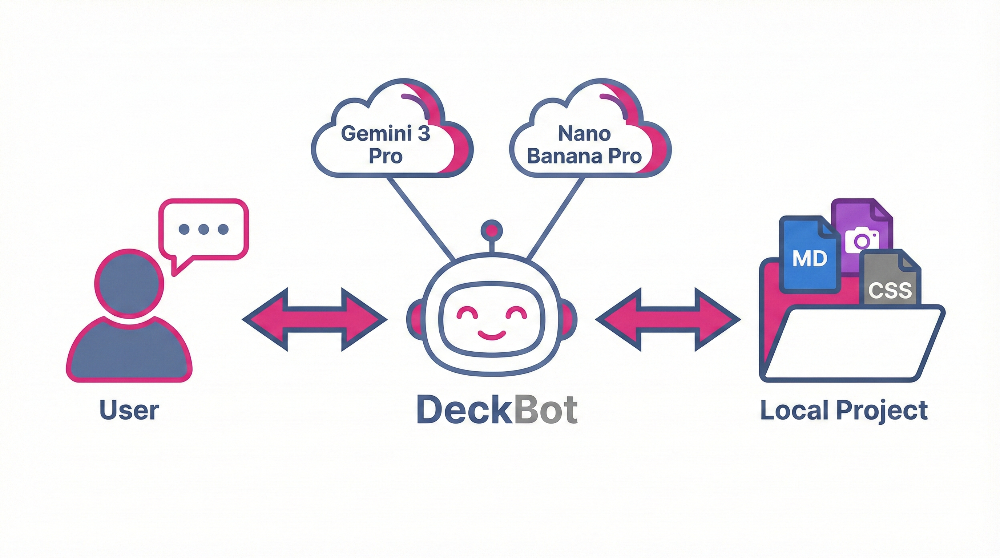

# DeckBot
> **It can't make you a better communicator. But it can manage your slide deck for you.**

DeckBot is a different kind of AI presentation tool. It's not a SaaS platform, it's not a plugin, and it's not trying to lock you into a proprietary format.

It is a love letter to two emerging AI concepts: **Everything as Code** and **Give an Agent a Tool**.



## The Concept: "Vibe Coding" for Slides


Most AI slide generators act like a vending machine: you put in a prompt, and you get a finished product. If you don't like it, you either generate a new one or struggle with a complex drag-and-drop editor.

DeckBot is different. It treats your presentation as a **software project**. The single source of truth is a simple [Marp](https://marp.app/) project—just Markdown files, images, and CSS stored right on your computer.

This enables a "vibe coding" workflow:
1.  **You talk to the agent** about what you want ("Make the intro punchier," "Change the color scheme to neon cyberpunk," "Add a slide about Q4 metrics").
2.  **The agent edits the code** directly.
3.  **You see the results instantly** in the live preview.

Because it's just code, you can iterate endlessly. The AI doesn't just "make a deck"—it *manages* the deck for you, handling the tedious formatting and file management while you focus on the story.

## Why DeckBot?

### 1. Everything as Code


Your deck isn't hidden in a database. It's a folder of files on your machine.
*   **Git-ready:** Version control your presentations like code.
*   **Interoperable:** Edit the Markdown in VS Code, Obsidian, or Cursor.
*   **Portable:** No "export" needed to own your data.

### 2. Give an Agent a Tool
Instead of hard-coding every feature, DeckBot gives a powerful LLM (Google Gemini) a set of tools:
*   **File System Access:** To read and edit slides.
*   **Image Generation:** To create custom visuals (via Google Imagen).
*   **Compilation:** To turn Markdown into HTML/PDF.
*   **Live Preview:** To see changes immediately.

### 3. Local Control, Powerful AI
DeckBot runs on your machine. Your files stay on your machine. But it leverages the power of state-of-the-art cloud models (Gemini Pro) for intelligence and image generation. You get the best of both worlds: the privacy and control of local files with the capability of top-tier AI.

---

## The Landscape: How We Compare

There are dozens of AI presentation tools out there. Here is how DeckBot fits in.

| Feature | NotebookLM | Kimi Slides / Gamma | Presenton | DeckBot |
| :--- | :--- | :--- | :--- | :--- |
| Primary Goal | Quick Summary | Polished Design | Privacy & Local Control | Iterative Content Control |
| AI Model | Cloud | Cloud | Local (Ollama/Llama) | Gemini Pro + NanoBanana Pro |
| Editing | None (Static Output) | Web UI / Drag-and-drop | Generation Scripts | "Vibe Coding" (Chat) |
| Source of Truth | Cloud Platform | Cloud Platform | Local Files | Local Markdown files |
| Ownership | Export only | Export only | 100% Yours | Local Data (Cloud AI) |

### Other Options

If DeckBot isn't what you're looking for, there is a crowded market of alternatives:

*   **For Speed & Polish:** Tools like [Gamma](https://gamma.app), [Beautiful.ai](https://www.beautiful.ai), and [Decktopus](https://www.decktopus.com) excel at creating beautiful, marketing-ready decks in seconds. They are great if you need a finished product *now* and don't mind a closed ecosystem.
*   **For Workflow Integration:** [Plus AI](https://plusai.com) and [Microsoft Copilot](https://www.microsoft.com/en-us/microsoft-365/powerpoint/ai-powerpoint-generator) integrate directly into Google Slides and PowerPoint, which is ideal if you need to stay in those tools.
*   **For Content Summarization:** [NotebookLM](https://notebooklm.google.com) and [Kimi Slides](https://kimi.moonshot.cn) are amazing at turning documents into presentations, though editing the result can sometimes be rigid.
*   **Open Source:** Projects like [Presenton](https://presenton.ai) and **slide-deck-ai** offer other approaches to local/code-based generation.

**DeckBot is for the builders, the tinkerers, and anyone who believes that the best way to manage complex information is as clear, version-controlled text.**

---

## Features

*   **Iterative Refinement**: Continuously refine your presentation through natural language.
*   **AI Coding Assistant**: A specialized Gemini-powered agent that acts as your pair programmer for slides.
*   **Integrated Image Generation**: Uses Google Imagen (via Nano Banana) to generate and insert custom images, with automatic batch tracking and history.
*   **Live Web UI**: A local web interface for previewing slides, selecting themes, and chatting with the agent.
*   **PDF Export**: Compile your finished deck to PDF for sharing.

## Installation

1.  **Clone and Environment Setup:**
    ```bash
    conda create -n deckbot python=3.11
    conda activate deckbot
    pip install -e .
    ```

2.  **External Dependencies:**
    *   **Node.js & npm**: Required for Marp CLI (preview/export).
    *   **Chrome/Chromium**: Required for PDF export.

3.  **Configuration:**
    Create a `.env` file in the project root with your Google AI API key:
    ```bash
    GOOGLE_API_KEY=your_api_key_here
    ```
    Get your API key from [Google AI Studio](https://aistudio.google.com/apikey).

## Usage

### Web UI (Recommended)
Run the CLI to launch the web interface:
```bash
deckbot
```
Open `http://localhost:5555` to create decks, chat with the agent, and see live updates.

### Text Mode
For a pure terminal experience:
```bash
deckbot --text
```

### Common Commands
*   `deckbot create my-deck --template Simple`
*   `deckbot templates list`
*   `deckbot preview my-deck`

---

## Development

This project follows **Behavior Driven Development (BDD)**.
*   **Specs first:** All features are defined in `features/*.feature`.
*   **Test-driven:** We run `behave` to verify everything works.
*   **Semantic Release:** Automated versioning based on conventional commits.

Run tests:
```bash
behave
```

## Contributing

Contributions are welcome! Whether it's bug reports, feature requests, or pull requests, we'd love to hear from you.

1.  Check out [CONTRIBUTING.md](CONTRIBUTING.md) for guidelines.
2.  Fork the repo and create your feature branch.
3.  Ensure your changes pass the BDD tests (`behave`).
4.  Submit a pull request.

## License

This project is licensed under the MIT License. See the LICENSE file for details.

---

<p align="center">
  <i>Built with ❤️, Python, and Gemini. ((And Claude.  And GPT.  And Nano Banana.)</i>
</p>
