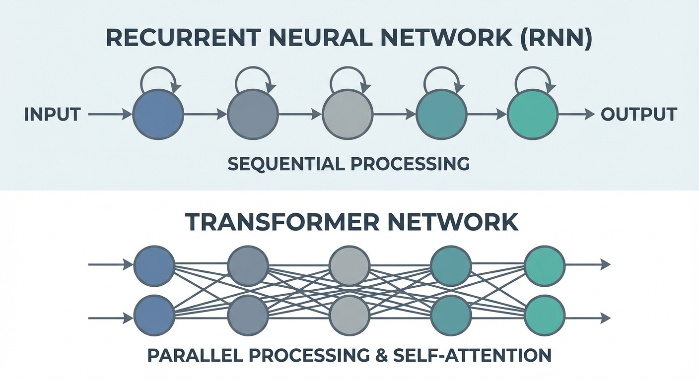
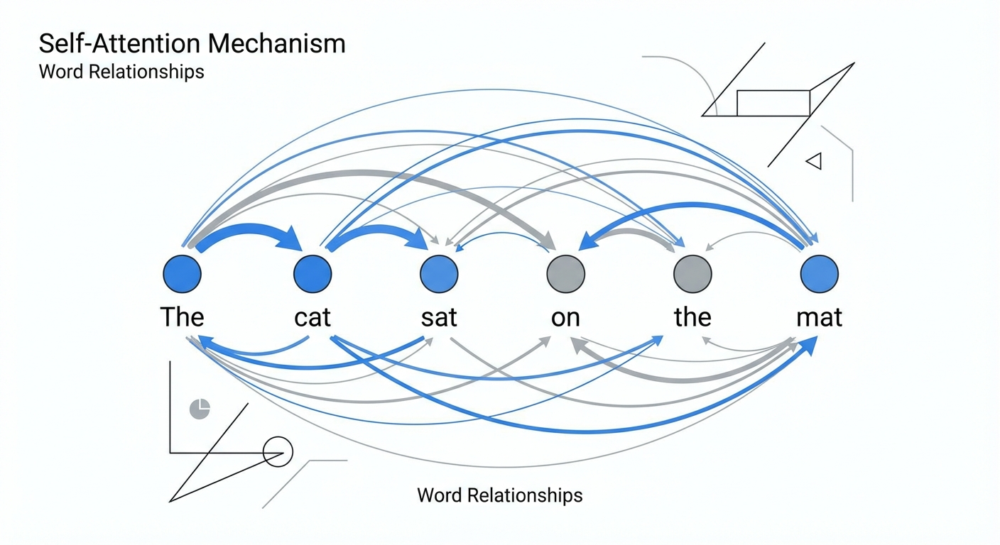
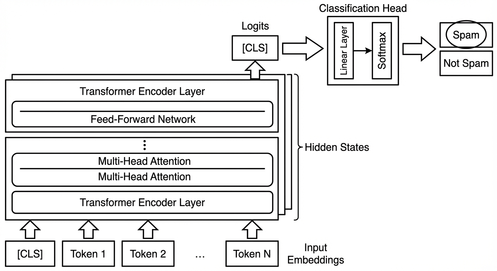

# BERT For Sequence Classification
## A Technical Deep Dive for Stakeholders

Explaining the architecture, mechanics, and business value of Transformer-based classification.

---

# The Pre-BERT Era: The Context Problem

Before Transformers, models like RNNs and LSTMs read text sequentially (left-to-right).

- **The Issue:** They struggled with long-range dependencies.
- **Example:** "I went to the **bank**..." vs "I sat on the river **bank**."
- **Limitation:** Hard to disambiguate meaning without "future" context.

---

# Enter BERT
**B**idirectional **E**ncoder **R**epresentations from **T**ransformers.

Unlike its predecessors, BERT reads the entire sequence of words at once.

- **Architecture:** A stack of Transformer Encoders.
- **Key Innovation:** Bidirectionality. It learns information from both the left and right context in all layers.
- **Result:** A deeply contextualized understanding of language.

---

# The Core Mechanism: Self-Attention

How does it understand context? **Self-Attention**.

1.  Every word in a sentence "looks at" every other word.
2.  It calculates a relevance score (attention weight).
3.  The representation of "bank" is updated based on "deposit" and "money".
4.  This creates a dynamic, context-heavy vector for each token.

---

# The Secret Weapon: Pre-training & Fine-tuning

BERT changed the paradigm from "train from scratch" to **Transfer Learning**.

## Phase 1: Pre-training (Expensive)
- Trained on massive corpuses (Wikipedia + BooksCorpus).
- Tasks: **Masked Language Modeling (MLM)** and **Next Sentence Prediction (NSP)**.
- *Outcome:* The model learns the fundamental structure of language.

## Phase 2: Fine-tuning (Cheap & Fast)
- We take the pre-trained "Language Brain".
- We add a small layer on top for our specific task (e.g., Sentiment Analysis).
- We train for a few epochs on our specific data.

---

# Specifics: Sequence Classification

How do we use BERT to classify a whole document?

1.  **Input Formatting:** The text is tokenized. A `[CLS]` token is added to the start.
2.  **Processing:** The entire sequence passes through BERT layers.
3.  **The `[CLS]` Vector:** This vector captures the "aggregate representation".
4.  **Classification Head:** A simple layer predicts the label from the `[CLS]` vector.

---

# Why It Matters for Business

For highly-technical stakeholders, the value proposition is clear:

1.  **State-of-the-Art Accuracy:** Consistently outperforms LSTMs/RNNs on GLUE benchmarks.
2.  **Data Efficiency:** Because BERT already "knows" English, you need significantly fewer labeled examples to achieve high performance.
3.  **Versatility:** The same underlying model can be fine-tuned for Sentiment Analysis, Intent Detection, or Spam Filtering with minimal architectural changes.
