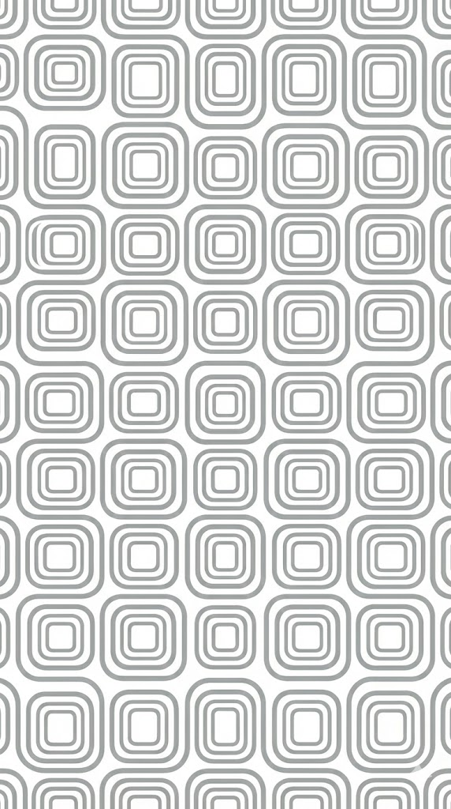
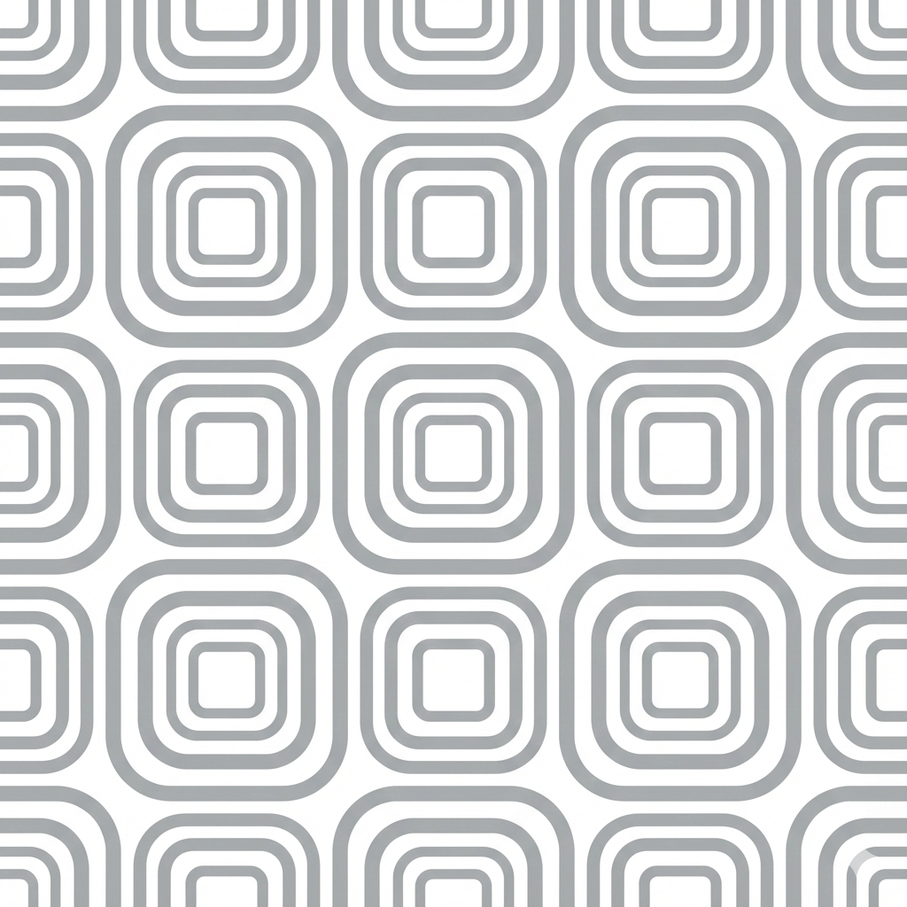

<!-- _class: title -->
<!-- _backgroundImage: url('images/background.png') -->

# Goldberg Maximal

## A clean, minimalist presentation template

---

## Clean Typography

- Simple, clear communication
- Modern sans-serif headings with *Inter*
- Elegant serif body text with *Source Serif Pro*

---

## Smart Color Usage

**Primary accent**: Blue (#2F80ED)
**Emphasis**: Soft Red (#EB5757)

> Clean, professional, and uncluttered

---

<!-- _class: image-left -->

# Image Left Layout

## Portrait images (9:16)

Perfect for vertical content like:
- Screenshots
- Product photos
- Portraits

---

<!-- _class: two-column -->

# Two-Column Layout

## Vertical images

Great for side-by-side comparisons

## Split content

Text and images work together

---

<!-- _class: full-image -->

